# Evidence Collection Sheet

## Required screenshots
- Langfuse trace list with >= 10 traces
- One full trace waterfall
- JSON logs showing correlation_id
- Log line with PII redaction
- Dashboard with 6 panels
- Alert rules with runbook link

## Optional screenshots
- Incident before/after fix
- Cost comparison before/after optimization
- Auto-instrumentation proof

---

## Load Test + Incident Injection Evidence

### validate_logs.py Result
- Score: **100/100**
- Total records: 192
- Correlation IDs found: 100
- PII leaks: 0
- All checks passed: Basic JSON schema, Correlation ID propagation, Log enrichment, PII scrubbing

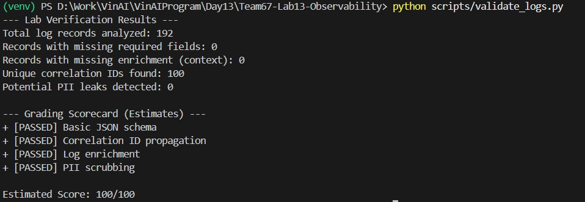

### Baseline Load Test (`--concurrency 1`)
- All 10 requests returned HTTP 200
- Average latency: ~158–162ms
- Features covered: `qa`, `summary`

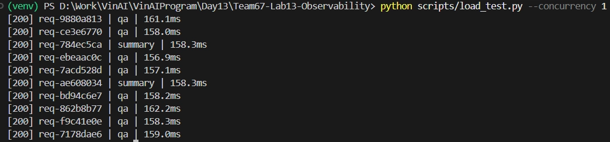

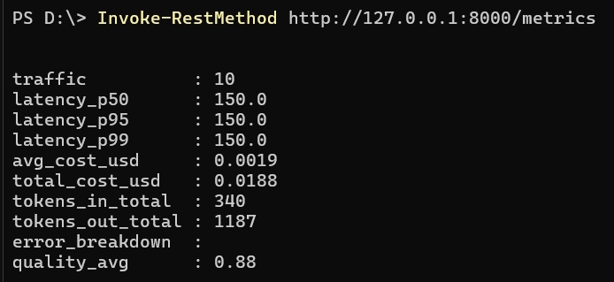

### Concurrent Load Test (`--concurrency 5`)
- All 10 requests returned HTTP 200
- Latency range: 325–805ms (thread contention expected)

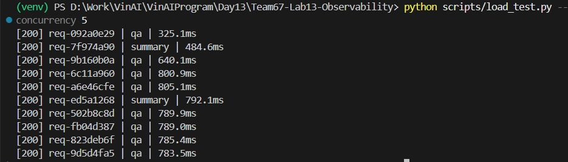

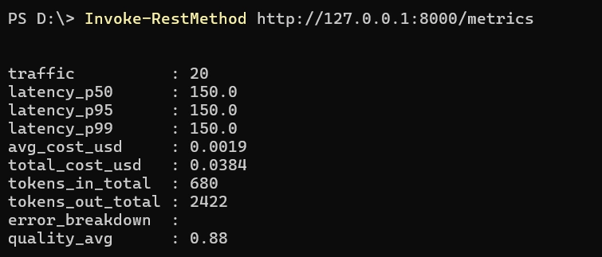

### Incident: `rag_slow`
- Enabled via: `python scripts/inject_incident.py --scenario rag_slow`
- Effect: RAG `retrieve()` sleeps 2.5s → latency spiked to **~7970–7979ms**
- All 10 requests still returned HTTP 200
- Root cause visible in traces: slow RAG span
- Disabled after test

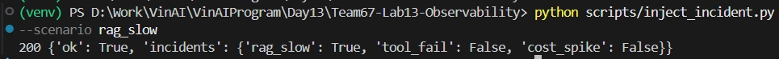

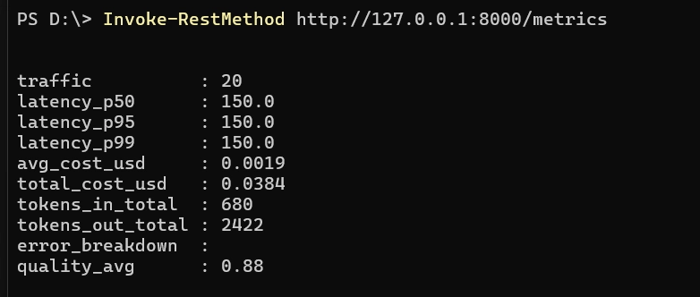

### Incident: `tool_fail`
- Enabled via: `python scripts/inject_incident.py --scenario tool_fail`
- Effect: RAG raises `RuntimeError("Vector store timeout")` → all requests returned **HTTP 500**
- `correlation_id` is `None` (error path, no response body)
- Error counter incremented in `/metrics`
- Root cause: `error_type=RuntimeError` visible in structured logs
- Disabled after test

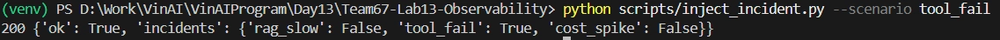

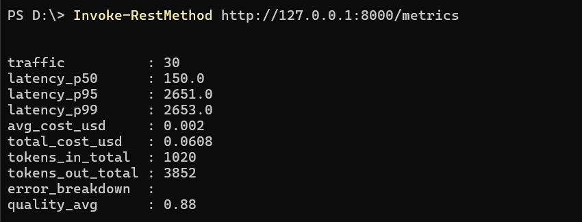

### Incident: `cost_spike`
- Enabled via: `python scripts/inject_incident.py --scenario cost_spike`
- Effect: `output_tokens` multiplied 4x → elevated `avg_cost_usd` and `total_tokens_out` in `/metrics`
- All requests returned HTTP 200 (functional, but expensive)
- Root cause: `tokens_out` spike visible in metrics snapshot
- Disabled after test

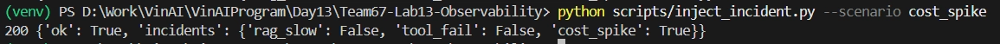

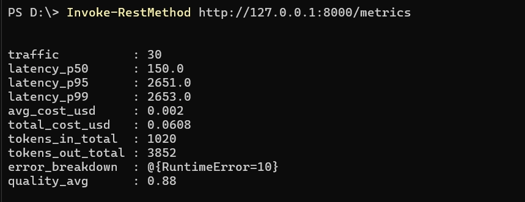

### Screenshots
- [validate_logs.png](screenshots/validate_logs.png)
- [baseline_cmd.png](screenshots/baseline_cmd.png)
- [rag_slow_cmd.png](screenshots/rag_slow_cmd.png)
- [tool_fail_cmd.png](screenshots/tool_fail_cmd.png)
- [cost_spike_cmd.png](screenshots/cost_spike_cmd.png)